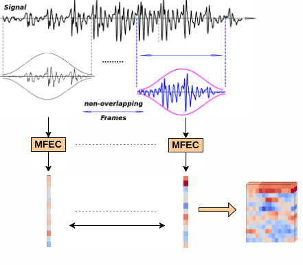

.. image:: _images/speechpy_logo.gif
    :target: https://github.com/astorfi/speech_feature_extraction/blob/master/images/speechpy_logo.gif
   
===============================================
`SpeechPy Official Project Documentation`_
===============================================

.. image:: https://pepy.tech/badge/speechpy
   :target: https://pepy.tech/project/speechpy
.. image:: https://img.shields.io/badge/contributions-welcome-brightgreen.svg?style=flat
    :target: https://github.com/astorfi/speechpy/pulls
.. image:: https://coveralls.io/repos/github/astorfi/speechpy/badge.svg?branch=master
    :target: https://coveralls.io/github/astorfi/speechpy?branch=master
.. image:: https://codecov.io/gh/astorfi/speechpy/branch/master/graph/badge.svg
    :target: https://codecov.io/gh/astorfi/speechpy
.. image:: https://badge.fury.io/py/speechpy.svg
    :target: https://badge.fury.io/py/speechpy
.. image:: http://joss.theoj.org/papers/10.21105/joss.00749/status.svg
    :target: https://doi.org/10.21105/joss.00749
.. image:: https://img.shields.io/twitter/follow/amirsinatorfi.svg?label=Follow&style=social
      :target: https://twitter.com/amirsinatorfi
    
.. .. image:: https://zenodo.org/badge/DOI/10.5281/zenodo.810391.svg
   ..  :target: https://doi.org/10.5281/zenodo.810391

.. _SpeechPy Official Project Documentation: http://speechpy.readthedocs.io

==========================
Table of Contents
==========================
.. contents::
  :local:
  :depth: 3

---------------------
Documentation
---------------------

This library provides most frequent used speech features including MFCCs and filterbank energies alongside with the log-energy of filterbanks.
If you are interested to see what are MFCCs and how they are generated please refer to this
`wiki <https://github.com/astorfi/speech_feature_extraction/wiki/>`_ page.

.. image:: _images/speech.gif

Please refer to the following links for further informations:

`SpeechPy Official Project Documentation`_

`Paper`_

.. _SpeechPy Official Project Documentation: http://speechpy.readthedocs.io
.. _Paper: https://doi.org/10.21105/joss.00749

------------------------------------------
Which Python versions are supported
------------------------------------------

Currently, the package has been tested and verified using Python ``2.7``, ``3.4`` and ``3.5``.

---------------------
Citation
---------------------

If you used this package, please kindly cite it as follows:

.. code:: bash

	    @article{torfi2018speechpy,
	      title={SpeechPy-A Library for Speech Processing and Recognition},
	      author={Torfi, Amirsina},
	      journal={arXiv preprint arXiv:1803.01094},
	      year={2018}
             }

---------------------
How to Install?
---------------------

There are two possible ways for installation of this package: local installation and PyPi.

~~~~~~~~~~~~~~~~~~~
Local Installation
~~~~~~~~~~~~~~~~~~~

For local installation at first the repository must be cloned::

	git clone https://github.com/astorfi/speech_feature_extraction.git

After cloning the reposity, root to the repository directory then execute::

	python setup.py develop

~~~~~
Pypi
~~~~~

The package is available on PyPi. For direct installation simply execute the following:

.. code-block:: shell

     pip install speechpy

------------------------------------------
What Features are supported?
------------------------------------------
- Mel Frequency Cepstral Coefficients(MFCCs)
- Filterbank Energies
- Log Filterbank Energies

Please refer to `SpeechPy Official Project Documentation`_ for details about the supported features.

~~~~~~~~~~~~~~
MFCC Features
~~~~~~~~~~~~~~

|pic1| |pic2|

.. |pic1| image:: _images/Speech_GIF.gif
   :width: 45%

The supported attributes for generating MFCC features can be seen by investigating the related function:

.. code-block:: python

      def mfcc(signal, sampling_frequency, frame_length=0.020, frame_stride=0.01,num_cepstral =13,
             num_filters=40, fft_length=512, low_frequency=0, high_frequency=None, dc_elimination=True):
	    """Compute MFCC features from an audio signal.
	    :param signal: the audio signal from which to compute features. Should be an N x 1 array
	    :param sampling_frequency: the sampling frequency of the signal we are working with.
	    :param frame_length: the length of each frame in seconds. Default is 0.020s
	    :param frame_stride: the step between successive frames in seconds. Default is 0.02s (means no overlap)
	    :param num_filters: the number of filters in the filterbank, default 40.
	    :param fft_length: number of FFT points. Default is 512.
	    :param low_frequency: lowest band edge of mel filters. In Hz, default is 0.
	    :param high_frequency: highest band edge of mel filters. In Hz, default is samplerate/2
	    :param num_cepstral: Number of cepstral coefficients.
	    :param dc_elimination: hIf the first dc component should be eliminated or not.
	    :returns: A numpy array of size (num_frames x num_cepstral) containing mfcc features.
	    """

~~~~~~~~~~~~~~~~~~~~~~~~~~~
Filterbank Energy Features
~~~~~~~~~~~~~~~~~~~~~~~~~~~

.. code-block:: python

	def mfe(signal, sampling_frequency, frame_length=0.020, frame_stride=0.01,
		  num_filters=40, fft_length=512, low_frequency=0, high_frequency=None):
	    """Compute Mel-filterbank energy features from an audio signal.
	    :param signal: the audio signal from which to compute features. Should be an N x 1 array
	    :param sampling_frequency: the sampling frequency of the signal we are working with.
	    :param frame_length: the length of each frame in seconds. Default is 0.020s
	    :param frame_stride: the step between successive frames in seconds. Default is 0.02s (means no overlap)
	    :param num_filters: the number of filters in the filterbank, default 40.
	    :param fft_length: number of FFT points. Default is 512.
	    :param low_frequency: lowest band edge of mel filters. In Hz, default is 0.
	    :param high_frequency: highest band edge of mel filters. In Hz, default is samplerate/2
	    :returns:
		      features: the energy of fiterbank: num_frames x num_filters
		      frame_energies: the energy of each frame: num_frames x 1
	    """

~~~~~~~~~~~~~~~~~~~~~~~~~~~~~~~~~
log - Filterbank Energy Features
~~~~~~~~~~~~~~~~~~~~~~~~~~~~~~~~~

The attributes for ``log_filterbank energies`` are the same for ``filterbank energies`` too.

.. code-block:: python

	def lmfe(signal, sampling_frequency, frame_length=0.020, frame_stride=0.01,
             num_filters=40, fft_length=512, low_frequency=0, high_frequency=None):
	    """Compute log Mel-filterbank energy features from an audio signal.
	    :param signal: the audio signal from which to compute features. Should be an N x 1 array
	    :param sampling_frequency: the sampling frequency of the signal we are working with.
	    :param frame_length: the length of each frame in seconds. Default is 0.020s
	    :param frame_stride: the step between successive frames in seconds. Default is 0.02s (means no overlap)
	    :param num_filters: the number of filters in the filterbank, default 40.
	    :param fft_length: number of FFT points. Default is 512.
	    :param low_frequency: lowest band edge of mel filters. In Hz, default is 0.
	    :param high_frequency: highest band edge of mel filters. In Hz, default is samplerate/2
	    :returns:
		      features: the energy of fiterbank: num_frames x num_filters
		      frame_log_energies: the log energy of each frame: num_frames x 1
	    """

~~~~~~~~~~~~
Stack Frames
~~~~~~~~~~~~

In ``Stack_Frames`` function, the stack of frames will be generated from the signal.

.. code-block:: python

	def stack_frames(sig, sampling_frequency, frame_length=0.020, frame_stride=0.020, Filter=lambda x: numpy.ones((x,)),
                 zero_padding=True):
	    """Frame a signal into overlapping frames.
	    :param sig: The audio signal to frame of size (N,).
	    :param sampling_frequency: The sampling frequency of the signal.
	    :param frame_length: The length of the frame in second.
	    :param frame_stride: The stride between frames.
	    :param Filter: The time-domain filter for applying to each frame. By default it is one so nothing will be changed.
	    :param zero_padding: If the samples is not a multiple of frame_length(number of frames sample), zero padding will
				 be done for generating last frame.
	    :returns: Array of frames. size: number_of_frames x frame_len.
	    """

---------------------
Post Processing
---------------------

There are some post-processing operation that are supported in ``speechpy``.

~~~~~~~~~~~~~~~~~~~~~~~~~~~~~~~~~~~~~~~~~~~~~~~~~~~~~~
Global cepstral mean and variance normalization (CMVN)
~~~~~~~~~~~~~~~~~~~~~~~~~~~~~~~~~~~~~~~~~~~~~~~~~~~~~~

This function performs global cepstral mean and variance normalization
(CMVN) to remove the channel effects. The code assumes that there is one
observation per row.

.. code-block:: python

  def cmvn(vec, variance_normalization=False):
      """
      This function is aimed to perform global ``cepstral mean and variance normalization``
      (CMVN) on input feature vector "vec". The code assumes that there is one observation per row.

      :param:
            vec: input feature matrix (size:(num_observation,num_features))
            variance_normalization: If the variance normilization should be performed or not.
      :return:
            The mean(or mean+variance) normalized feature vector.
      """

~~~~~~~~~~~~~~~~~~~~~~~~~~~~~~~~~~~~~~~~~~~~~~~~~~~~~~~~~~~~~~~~~~~~~~~~~~~
Local cepstral mean and variance normalization (CMVN) over a sliding window
~~~~~~~~~~~~~~~~~~~~~~~~~~~~~~~~~~~~~~~~~~~~~~~~~~~~~~~~~~~~~~~~~~~~~~~~~~~

This function performs local cepstral mean and variance normalization
(CMVN) over sliding windows. The code assumes that there is one
observation per row.

.. code-block:: python

    def cmvnw(vec, win_size=301, variance_normalization=False):
        """
        This function is aimed to perform local cepstral mean and variance normalization on a sliding window.
        (CMVN) on input feature vector "vec". The code assumes that there is one observation per row.
        :param
              vec: input feature matrix (size:(num_observation,num_features))
              win_size: The size of sliding window for local normalization and should be odd.
                        default=301 which is around 3s if 100 Hz rate is considered(== 10ms frame stide)
              variance_normalization: If the variance normilization should be performed or not.

        :return: The mean(or mean+variance) normalized feature vector.
        """

-----
Tests
-----

SpeechPy includes some unit tests. To run the tests, ``cd`` into the
``speechpy/tests`` directory and run:

.. code-block:: shell

     python -m pytest

For installing the requirements you only need to install ``pytest``.

------------
Example
------------

The test example can be seen in ``test/test.py`` as below:

.. code-block:: python

    import scipy.io.wavfile as wav
    import numpy as np
    import speechpy
    import os

    file_name = os.path.join(os.path.dirname(os.path.abspath(__file__)),'Alesis-Sanctuary-QCard-AcoustcBas-C2.wav')
    fs, signal = wav.read(file_name)
    signal = signal[:,0]

    # Example of pre-emphasizing.
    signal_preemphasized = speechpy.processing.preemphasis(signal, cof=0.98)

    # Example of staching frames
    frames = speechpy.processing.stack_frames(signal, sampling_frequency=fs, frame_length=0.020, frame_stride=0.01, filter=lambda x: np.ones((x,)),
             zero_padding=True)

    # Example of extracting power spectrum
    power_spectrum = speechpy.processing.power_spectrum(frames, fft_points=512)
    print('power spectrum shape=', power_spectrum.shape)

    ############# Extract MFCC features #############
    mfcc = speechpy.feature.mfcc(signal, sampling_frequency=fs, frame_length=0.020, frame_stride=0.01,
                 num_filters=40, fft_length=512, low_frequency=0, high_frequency=None)
    mfcc_cmvn = speechpy.processing.cmvnw(mfcc,win_size=301,variance_normalization=True)
    print('mfcc(mean + variance normalized) feature shape=', mfcc_cmvn.shape)

    mfcc_feature_cube = speechpy.feature.extract_derivative_feature(mfcc)
    print('mfcc feature cube shape=', mfcc_feature_cube.shape)

    ############# Extract logenergy features #############
    logenergy = speechpy.feature.lmfe(signal, sampling_frequency=fs, frame_length=0.020, frame_stride=0.01,
                 num_filters=40, fft_length=512, low_frequency=0, high_frequency=None)
    logenergy_feature_cube = speechpy.feature.extract_derivative_feature(logenergy)
    print('logenergy features=', logenergy.shape)

For ectracting the feature at first, the signal samples will be stacked into frames. The features are computed for each frame in the stacked frames collection.

---------------------
Dependencies
---------------------

Two packages of ``Scipy`` and ``NumPy`` are the required dependencies which will be installed automatically by running the ``setup.py`` file.

---------------------
Acknowledgements
---------------------

This work is based upon a work supported by the Center for Identification Technology Research and the National Science Foundation under Grant #1650474.

---------------------
Contributing
---------------------

When contributing to this repository, you are more than welcome to discuss your feedback with any of the owners of this repository. *For typos, please do not create a pull request. Instead, declare them in issues or email the repository owner*. For technical and conceptual questions please feel free to **directly contact the repository owner**. Before asking general questions related to the concepts and techniques provided in this project, **please make sure to read and understand its associated paper**.

~~~~~~~~~~~~~~~~~~~~~~~~
Pull Request Process
~~~~~~~~~~~~~~~~~~~~~~~~

Please consider the following criterions in order to help us in a better way:

1. The pull request is mainly expected to be a code script suggestion or improvement.
2. A pull request related to non-code-script sections is expected to make a significant difference in the documentation. Otherwise, it is expected to be announced in the issues section.
3. Ensure any install or build dependencies are removed before the end of the layer when doing a
   build and creating a pull request.
4. Add comments with details of changes to the interface, this includes new environment
   variables, exposed ports, useful file locations and container parameters.
5. You may merge the Pull Request in once you have the sign-off of at least one other developer, or if you
   do not have permission to do that, you may request the owner to merge it for you if you believe all checks are passed.

~~~~~~~~~~~~~~~~~~~~~~~~
Declaring issues
~~~~~~~~~~~~~~~~~~~~~~~~

For declaring issues, you can directly email the repository owner. However, preferably please create an issue as it might be
the issue that other repository followers may encounter. That way, the question to other developers will be answered as well.

~~~~~~~~~~~~~~~~~~~~~~~~
Final Note
~~~~~~~~~~~~~~~~~~~~~~~~

We are looking forward to your kind feedback. Please help us to improve this open source project and make our work better.
For contribution, please create a pull request and we will investigate it promptly. Once again, we appreciate
your kind feedback and elaborate code inspections.

---------------------
Disclaimer
---------------------

Although by dramatic chages, some portion of this library is inspired by the `python speech features`_ library.

.. _python speech features: https://github.com/jameslyons/python_speech_features

We clain the following advantages for our library:

1. More accurate operations have been performed for the mel-frequency calculations.
2. The package supports different ``Python`` versions.
3. The feature are generated in a more organized way as cubic features.
4. The package is well-tested and integrated.
5. The package is up-to-date and actively developing.
6. The package has been used for research purposes.
7. Exceptions and extreme cases are handled in this library.
